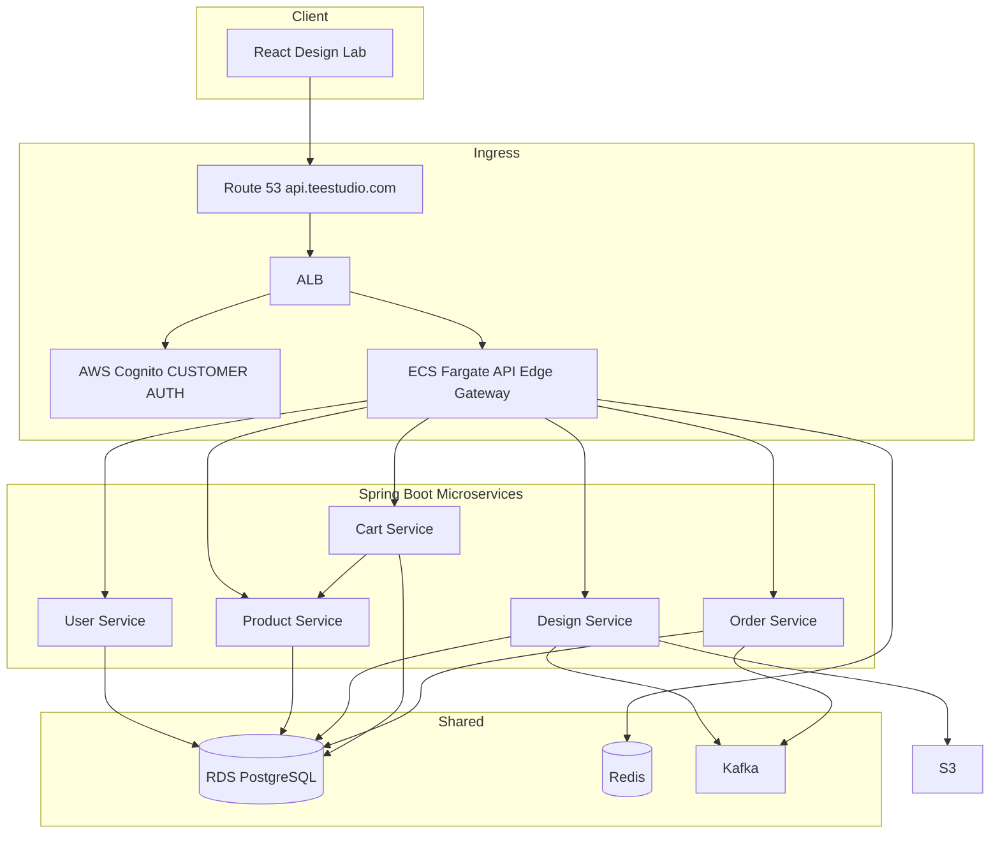

# TeeStudio E-commerce Platform – Implementation Plan (Microservices Architecture)

**Overview:** Implement the AI-driven custom merch platform as five Spring Boot microservices behind an ECS Fargate API Edge Gateway, with shared RDS PostgreSQL (per-entity schemas), Redis, Kafka, Cognito/JWT auth, and React frontend, per the approved architecture.

---

## Current State

- **Backend:** Single Spring Boot 3.2 app ([pom.xml](pom.xml)) with [HelloController](src/main/java/com/example/teestudio/controller/HelloController.java); no microservices, no shared data plane.
- **Deployment:** [task-definition.json](task-definition.json) (Fargate), [CloudFormation ECS + ALB](.github/cloudformation/ecs-fargate-alb.yml), [GitHub Actions](.github/workflows/deploy-ecs.yml). Naming/region to align with TeeStudio (e.g. `teestudio`, target region).
- **Frontend:** None.

Target topology (from architecture diagram):

- **Entry:** Route 53 → ALB → Cognito (customer auth) → **API Edge Gateway** (JWT, Auth & Admin, proxy to services).
- **Shared data:** Single RDS PostgreSQL (all tables below), Redis (caching), Kafka (design-job, design-result, order-placed).
- **Design pipeline:** Design Service publishes `design-job` to Kafka; async worker/consumer runs Rekognition (safety) + image generation/LLM; writes assets to S3; publishes `design-result`; Design Service consumes and updates DB.

---

## Shared Data Plane – RDS PostgreSQL Schemas

Single database; tables grouped by owning service. All PKs UUIDs unless noted.

**User Service**

| Table                      | Columns                                                                                              |
| -------------------------- | ---------------------------------------------------------------------------------------------------- |
| `users`                    | PK `user_id`, `email` (UNIQUE), `password_hash`, `role` (CUSTOMER/ADMIN), `created_at`, `updated_at` |
| `user_email_confirmations` | PK `confirmation_id`, FK `user_id`, `token`, `expires_at`, `created_at`, `confirmed_at`              |
| `user_password_resets`     | PK `reset_id`, FK `user_id`, `token`, `expires_at`, `created_at`                                     |

**Product Service**

| Table              | Columns                                                                                                                                                            |
| ------------------ | ------------------------------------------------------------------------------------------------------------------------------------------------------------------ |
| `products`         | PK `product_id`, `name`, `description`, `price`, `category`, `image_url`, `embedding_vector`, `refined_prompt`, `content_safety_score`, `created_at`, `updated_at` |
| `product_variants` | PK `variant_id`, FK `product_id`, `color`, `size`, `stock_quantity`, `created_at`, `updated_at`                                                                    |
| `product_reviews`  | PK `review_id`, FK `user_id`, FK `product_id`, `rating`, `comment`, `created_at`                                                                                   |

**Design Service**

| Table                 | Columns                                                                                                                                                            |
| --------------------- | ------------------------------------------------------------------------------------------------------------------------------------------------------------------ |
| `design_sessions`     | PK `session_id`, FK `user_id` (optional), `status` (PENDING, DRAFT, COMPLETED), `prompt`, `created_at`, `updated_at`                                               |
| `design_images`       | PK `image_id`, FK `session_id`, `image_url`, `width`, `height`, `model_params`, `confidence_score`, `created_at`                                                   |
| `design_final_assets` | PK `final_asset_id`, FK `user_id`, FK `design_image_id`, `source_image_url`, `mockup_image_url`, `print_file_url`, `status` (PENDING, READY, FAILED), `created_at` |

**Cart Service**

| Table        | Columns                                                                                                                                                       |
| ------------ | ------------------------------------------------------------------------------------------------------------------------------------------------------------- |
| `carts`      | PK `cart_id`, FK `user_id` (optional), `session_id` (guests), `created_at`, `updated_at`                                                                      |
| `cart_items` | PK `cart_item_id`, FK `cart_id`, FK `product_id`, FK `product_variant_id`, FK `final_asset_id` (optional), `quantity`, `unit_price`, `subtotal`, `created_at` |

**Order Service**

| Table         | Columns                                                                                                                                                                              |
| ------------- | ------------------------------------------------------------------------------------------------------------------------------------------------------------------------------------ |
| `orders`      | PK `order_id`, FK `user_id`, `order_date`, `total_amount`, `status` (PENDING, PAID, SHIPPED, DELIVERED, CANCELED), `shipping_address`, `billing_address`, `created_at`, `updated_at` |
| `order_items` | PK `order_item_id`, FK `order_id`, FK `product_id`, FK `product_variant_id`, FK `final_asset_id`, `quantity`, `price_per_unit`, `subtotal`                                           |
| `payments`    | PK `payment_id`, FK `order_id`, `payment_date`, `provider` (Stripe), `transaction_id`, `amount`, `status` (PENDING, SUCCESS, FAILED), `created_at`                                   |

---

## Phase 1: Repo Layout, Shared DB, and API Edge Gateway

- **Repo structure:** Multi-module Maven (or Gradle) with one module per deployable: `api-gateway`, `user-service`, `product-service`, `design-service`, `cart-service`, `order-service`. Shared library optional (e.g. `common-dto`, `common-db`) for DTOs and DB config; alternatively each service owns its JPA entities and Flyway migrations for its tables only (same RDS, different migration paths).
- **Shared RDS:** One PostgreSQL database. Each service connects with same RDS URL (env); each service applies only its own schema (Flyway locations per service). Ensure FK dependencies are respected (e.g. User tables first, then Product, Design, Cart, Order).
- **API Edge Gateway:** New Spring Boot app: reverse-proxy to the five services (e.g. Spring Cloud Gateway or custom proxy). Responsibilities: (1) Validate JWT (from Cognito); (2) Enforce role (CUSTOMER vs ADMIN) and route to correct services; (3) Proxy `/users/*` → User Service, `/products/*` → Product Service, `/design-sessions/*` → Design Service, `/cart/*` → Cart Service, `/orders/*` and `/payments/*` → Order Service. Health check for ALB: e.g. `/actuator/health`. This becomes the single public backend (api.teestudio.com).
- **Auth:** Integrate AWS Cognito for customer login (frontend will use Cognito SDK; gateway validates Cognito-issued JWT). Admin routes require JWT with ADMIN role. No auth logic inside individual services if gateway is the only entry; alternatively, gateway forwards JWT and services validate (recommended: gateway validates and forwards `X-User-Id`, `X-Role` or similar).
- **Config:** Per-service `application-{profile}.properties`; RDS URL, Redis URL, and secrets from env or AWS Secrets Manager.

**Deliverables:** Multi-module layout, RDS schema applied (all tables) via per-service Flyway, API Edge Gateway running and routing to stub endpoints per service. Single ECS task for gateway initially; other services can run as separate ECS services or locally for dev.

---

## Phase 2: User Service

- **APIs:**
  - `POST /users` (registration)
  - `POST /users/login` (return JWT or delegate to Cognito; if using Cognito only, registration may be Cognito sign-up and this is "link to internal user" or deprecated)
  - `POST /users/confirm-registration`
  - `POST /users/password-reset`
  - Admin: `GET /users/{id}`, `DELETE /users/{id}`
- **Data:** Implement `users`, `user_email_confirmations`, `user_password_resets` with JPA and repositories. Align with Cognito (e.g. create/update user on Cognito event or on first login).
- **Security:** Passwords hashed (e.g. BCrypt); tokens with expiry.

**Deliverables:** User Service implementing the above APIs and DB operations; gateway routes `/users/*` to this service.

---

## Phase 3: Product Service

- **APIs:**
  - `GET /products`, `GET /products/{id}`
  - Admin: `POST /products`, `PUT /products/{id}`, `DELETE /products/{id}`
- **Data:** Implement `products`, `product_variants`, `product_reviews` (entities + repositories). Use Redis in front of read APIs (cache product list and by-id) with TTL/invalidation on admin write.
- **AI fields:** `embedding_vector`, `refined_prompt`, `content_safety_score` on `products` — leave nullable initially; populate in later phase (semantic search, AI review summary).

**Deliverables:** Product Service with public and admin APIs; Redis caching; gateway routes `/products/*` to this service.

---

## Phase 4: Design Service, Kafka, Rekognition, S3

- **APIs:**
  - `GET /design-sessions`, `POST /design-sessions`
  - `GET /design-sessions/{id}/images`, `POST /design-sessions/{id}/images`
- **Flow:**
  - On create/update that triggers generation: create/update `design_sessions` and `design_images` (e.g. status PENDING), then publish **design-job** to Kafka (session id, image id, prompt, etc.).
  - Async consumer (same service or separate worker): consume design-job → run **Rekognition** (image generation / LLM safety filter per diagram) and optional prompt refinement → generate image (e.g. Bedrock/Stable Diffusion), upload to **S3** (generated images, mockups, print-ready files) → update `design_images` and `design_final_assets` → publish **design-result** to Kafka.
  - Design Service may consume `design-result` to update session status or notify.
- **Data:** Implement `design_sessions`, `design_images`, `design_final_assets`; store S3 URLs in these tables.
- **Kafka topics:** `design-job`, `design-result`. Use spring-kafka; producer in Design Service; consumer in Design Service (or dedicated worker task).
- **IAM:** ECS task role for S3 (read/write design bucket) and Rekognition (and Bedrock if used).

**Deliverables:** Design Service with session and image APIs; Kafka producer/consumer; Rekognition integration for safety; S3 for generated images/mockups/print files; DB and events aligned with schema.

---

## Phase 5: Cart Service

- **APIs:**
  - `GET /cart`, `POST /cart` (add/update items)
  - `DELETE /cart/items/{id}`, `PUT /cart/items/{id}`
- **Data:** Implement `carts`, `cart_items` with FKs to `products`, `product_variants`, `design_final_assets`. Support guest carts via `session_id` and authenticated via `user_id`.
- **Integration:** Call **Product Service** over HTTP (internal) to resolve product details and price when adding items or returning cart. Use Redis to cache product lookups if desired.
- **Cart model:** One cart per user or per guest session; cart items reference `final_asset_id` for custom designs.

**Deliverables:** Cart Service with full CRUD and product resolution; gateway routes `/cart/*` to this service.

---

## Phase 6: Order Service, Payments, Kafka

- **APIs:**
  - `POST /orders` (create from cart)
  - `GET /orders`, `GET /orders/{id}`
  - `POST /payments/webhook` (Stripe webhook)
  - Admin: `GET /orders/{id}/status`, `PUT /orders/{id}/status`
- **Data:** Implement `orders`, `order_items`, `payments`; link order items to `product_id`, `product_variant_id`, `final_asset_id`.
- **Flow:** Create order from cart (call Cart Service to get cart, validate; create order and order_items; clear or mark cart). Publish **order-placed** to Kafka for fulfillment and status updates. On Stripe webhook, update `payments` and order status (e.g. PENDING → PAID).
- **Kafka:** Producer for `order-placed`; consumer(s) for fulfillment can be same or separate ECS service.

**Deliverables:** Order Service with order and payment APIs; Stripe webhook; Kafka `order-placed`; gateway routes `/orders/*` and `/payments/*` to this service.

---

## Phase 7: React Frontend – Design Lab and Checkout

- **Setup:** React app (e.g. Vite) under `frontend/`; call `api.teestudio.com` (or ALB URL in dev). Use Cognito for login/signup; send JWT on API requests. State management for cart and design session.
- **Design lab:** Create design session; submit prompt → POST design-sessions/images → poll or listen for design-result; show preview (image_url / mockup from Design Service). Optionally product/placement selection.
- **Live preview:** T-shirt mockup with design overlay using URLs from Design Service.
- **Cart:** Product listing (Product Service); add to cart with variant and optional `final_asset_id` (Cart Service). Cart page: edit, remove, subtotal.
- **Checkout:** Shipping/billing, redirect to Stripe (or Stripe Elements); after payment, Stripe calls `POST /payments/webhook`; frontend shows order confirmation and order id.

**Deliverables:** React app with design lab, live preview, cart, checkout, and Cognito auth; CORS and API base URL configured for gateway.

---

## Phase 8: AWS Production – Route 53, ALB, ECS, RDS, Redis, MSK

- **DNS:** Route 53 record for `api.teestudio.com` → ALB. Keep existing CloudFormation ALB/ECS or extend for multiple services.
- **ECS:** Separate ECS services for API Edge Gateway and each of the five microservices (and optional worker for design-job consumer). Each with its own task definition and image; gateway receives traffic from ALB; internal routing (gateway → services) via service discovery or internal ALB/listeners. Alternatively, run all backend services behind a single internal ALB and gateway as single entry.
- **Cognito:** User pool and app client; ALB or gateway validates Cognito JWT (e.g. ALB with Cognito action, or gateway only). Configure CORS and callback URLs for React.
- **RDS:** Single PostgreSQL in VPC (private subnets); all services use same endpoint; security groups allow ECS tasks. Credentials from Secrets Manager.
- **Redis:** ElastiCache in VPC; gateway and/or services use for caching; credentials if auth enabled.
- **Kafka:** AWS MSK; same VPC; bootstrap servers in env; IAM or SASL for auth. Topics: `design-job`, `design-result`, `order-placed`.
- **S3:** Bucket for design assets; ECS task role with read/write; Rekognition/Bedrock access as needed.
- **Secrets:** DB, Redis, Stripe webhook secret, Cognito keys in Secrets Manager or SSM; inject into ECS task definitions.
- **Naming/region:** Align [task-definition.json](task-definition.json) and [.github/workflows/deploy-ecs.yml](.github/workflows/deploy-ecs.yml) for TeeStudio (ECR repo, cluster, service names, region). Extend workflow to build and push each service image and deploy gateway + services.

**Deliverables:** Production env with api.teestudio.com → ALB → Gateway → five services; RDS, Redis, MSK, S3, Cognito wired; HA and scaling (multi-AZ, DesiredCount ≥ 2 for gateway and critical services); runbook for secrets and env.

---

## Phase 9 (Optional): Extensibility

- **Semantic product search:** Populate `products.embedding_vector` (e.g. Bedrock/OpenAI embeddings); add search API using vector similarity (pgvector or OpenSearch).
- **AI review summaries:** Aggregate `product_reviews`; generate summary via LLM; cache in Redis; expose on product detail.
- **Shopping assistant:** LLM-driven suggestions and design prompt refinement; can call Design Service and Product Service.

---

## Summary

| Phase | Focus                             | Key artifacts                                                         |
| ----- | --------------------------------- | --------------------------------------------------------------------- |
| 1     | Repo, shared DB, API Edge Gateway | Multi-module, Flyway schemas, gateway + Cognito/JWT                   |
| 2     | User Service                      | Registration, login, confirm, password reset, admin APIs              |
| 3     | Product Service                   | Products/variants/reviews APIs, Redis cache                          |
| 4     | Design Service                    | Design sessions/images APIs, Kafka design-job/result, Rekognition, S3 |
| 5     | Cart Service                      | Cart CRUD, Product Service HTTP client                                |
| 6     | Order Service                     | Orders, Stripe webhook, Kafka order-placed                            |
| 7     | React frontend                    | Design lab, preview, cart, checkout, Cognito                         |
| 8     | AWS production                    | Route 53, ALB, ECS (gateway + 5 svcs), RDS, Redis, MSK, S3, secrets   |
| 9     | Optional                          | Semantic search, AI reviews, assistant                               |

**Dependencies:** Phase 1 first. Phases 2–3 can run in parallel after 1. Phase 4 depends on 1 (DB + Kafka). Phase 5 depends on 3 (Product) and 4 (final_asset_id). Phase 6 depends on 2, 5 (User, Cart). Phase 7 after 2–6. Phase 8 throughout (incremental wiring of services and infra).
